<!-- Rajveer-code/Rajveer-code : profile README. Paste into the special repo named exactly "Rajveer-code". -->
<meta name="google-site-verification" content="ulma8pVtPkxh6YRWcrvCQVg2ka8wKrE75kA-Pf2MDpU" />

<div align="center">

**B.Tech Computer Science &amp; Business Systems** · Gyan Ganga Institute of Technology and Sciences, Jabalpur, India
*MSc / MS Applicant 2027*

<a href="https://rajveer-code-github-io.vercel.app/"></a>
<a href="https://rajveer-research-3s4rjgexs-rajveer-codes-projects.vercel.app/"></a>

[](mailto:rajveerpall04@gmail.com)
[](https://www.linkedin.com/in/rajveer-singh-pall)
[](https://orcid.org/0009-0001-6762-6134)
[](https://github.com/Rajveer-code)

</div>

<!-- ── animated whoami: ASCII portrait + neofetch card ─────────────── -->
<div align="center">

<h3><code>rajveer@github ~ $ whoami</code></h3>

<table>
  <tr>
    <td valign="top"></td>
    <td valign="top"></td>
  </tr>
</table>

</div>

---

## &#128218;&nbsp; Research

I study two related questions: **when do machine-learning systems fail the people they are meant to serve**, and **what does rigorous causal identification reveal about structural discrimination in financial markets?**

My published and submitted work spans healthcare ML fairness, racial disparities in mortgage lending, market microstructure, and cross-domain deployment reliability — united by a commitment to **external validity, honest negative results, and methods that hold up under scrutiny.**

<div align="center">


</div>

---

## &#127775;&nbsp; Flagship — TrustShift

> **Shift type, not shift magnitude, determines machine-learning failure modes under deployment shift.**

One pre-registered audit protocol applied to **four dissimilar real-world domains** (clinical, mental-health NLP, mortgage lending over 42M records, network intrusion). The finding: the *type* of distribution shift — not its magnitude — predicts *which* axis of trustworthiness (discrimination, calibration, or subgroup reliability) breaks at deployment, and it is diagnosable in advance with cheap, label-free probes.

[](https://github.com/Rajveer-code/trustshift)
[](https://github.com/Rajveer-code/trustshift)
[](https://huggingface.co/datasets/Rajveer-code/trustshift)


---

## &#128220;&nbsp; Publications

### &#9989;&nbsp; Accepted

**Comprehensive Evaluation of Machine Learning for Type&nbsp;2 Diabetes Risk Prediction: Large-Scale External Validation and Fairness Analysis**
<sub>Rajveer Singh Pall, Sameer Yadav, Siddharth Bhalerao, Sourabh Sahu, Ritu Ahluwalia, Bhaskar Awadhiya · **IEEE Conference**</sub>

XGBoost trained on NHANES 2015–2020 (n&nbsp;=&nbsp;15,685), externally validated on BRFSS 2020–2022 (n&nbsp;=&nbsp;1,285,783). Internal AUC 0.794 degraded to 0.717 under distribution shift; a **13.5 AUC-point gap** between young (0.742) and elderly (0.607) adults means the highest-risk population receives the weakest algorithmic performance.

`XGBoost` `SHAP` `DeLong CI` `Algorithmic Fairness` `External Validation` `TRIPOD-AI`

### &#128236;&nbsp; Under Review

**Persistent Racial Disparities in U.S. Mortgage Approval: Evidence from 42 Million Applications, 2020–2024** · <sub>**Journal of Housing Economics**</sub>

42.3M applications, 5,500 lenders. Black applicants face a raw 14.95 pp approval gap; after DFL reweighting on all observable financials, **98.6% remains unexplained**. Within-lender fixed effects attribute 74.6% of the gap to *within-institution* decisions, rising 66.8%&nbsp;(2020)&nbsp;→&nbsp;78.3%&nbsp;(2024). RDD at the 80% LTV/PMI boundary and a DiD around the 2022 Fed tightening isolate two specific channels.

`Regression Discontinuity` `Difference-in-Differences` `DFL Decomposition` `HMDA` `Fixed Effects`

**The Transaction Cost Trap: Why ML Stock Prediction Fails Economically Under Realistic Frictions** · <sub>**Quantitative Finance and Economics**</sub>

A regime-filtered CatBoost/RF/DNN ensemble reaches **73.3% conditional directional accuracy** in bear regimes yet returns **−42.49% annually** (Sharpe −2.83) after 5 bps costs, versus buy-and-hold's +34.77%. A closed-form breakeven shows profitability needs **88% accuracy** — an explicit case against publication bias in financial ML.

`CatBoost` `DNN` `Walk-forward Validation` `Market Efficiency` `Ensemble Methods`

**TrustShift: Shift Type, Not Shift Magnitude, Determines ML Failure Modes** · <sub>**Applied Intelligence**</sub> — *see Flagship above.*

---

## &#129504;&nbsp; Methods &amp; Stack

<div align="center">

</div>

```text
Causal Inference     Causal Forests · Double ML · RDD · DiD · DFL Decomposition · Manski Bounds
Fairness             Subgroup AUC · DeLong CI · ECE · Equalised Odds · Disparate Impact
ML                   XGBoost · LightGBM · CatBoost · PyTorch · scikit-learn · Random Forest
NLP                  FinBERT · HuggingFace Transformers · RAG · SHAP
Federated / Privacy  Flower (flwr) · FedAvg · FedProx · FedNova · Opacus (DP)
Data at Scale        HMDA 42M · BRFSS 1.28M · NHANES · 17,773 stock-days · 14,584 transcripts
Languages            Python · R · SQL
```

---

## &#128295;&nbsp; Selected Projects

| Project | What it is |
|---|---|
| [`trustshift`](https://github.com/Rajveer-code/trustshift) | Cross-domain deployment-shift audit protocol + benchmark *(flagship)* |
| [`CATE-HMDA-Heterogeneous-Effects`](https://github.com/Rajveer-code/CATE-HMDA-Heterogeneous-Effects) | Heterogeneous treatment effects of mortgage discrimination (Causal Forests, DML) |
| [`Finsight`](https://github.com/Rajveer-code/Finsight) · [`finsight-web`](https://github.com/Rajveer-code/finsight-web) | LLM earnings-call intelligence over 14,584 S&P 500 transcripts · [live demo](https://finsight-web-rust.vercel.app) |
| [`SereneSpace`](https://github.com/Rajveer-code/SereneSpace) | Anonymous mental-wellness platform |

---

<div align="center">

<picture>
  <source media="(prefers-color-scheme: dark)" srcset="https://raw.githubusercontent.com/Rajveer-code/Rajveer-code/output/github-snake-dark.svg" />
  <source media="(prefers-color-scheme: light)" srcset="https://raw.githubusercontent.com/Rajveer-code/Rajveer-code/output/github-snake.svg" />
  
</picture>

</div>
